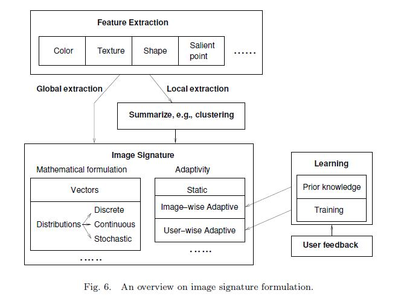

# Content-based image retrieval(CBIR)
## 名词
- sensory gap: 实际物体和记录物体（从场景记录中得到的计算信息描述）之间的差距
- semantic gap: 从可视数据中提取的信息和同样的数据在特定情况下的用户理解之间的不一致性。前者由于记录的限制有辨认图像内容的困难，后者则是从图像内容获得用户对图像理解的固有困难。
## 阶段
- 1994-2000 初级阶段
  图像搜索的三大类：  
  search by association:图片没有明显的意图，通过迭代优化浏览进行搜索？  
  aimed search:明确的图片搜索  
  category search:搜索代表一种语义类别的单张图像  
## 问题
目前所有的方法，基于视觉相似度判定语义相似度，由于低级内容和高级概念之间的语义鸿沟造成的问题。  
应用场景中对于视觉相似度和语义相似度的需要性。  

## 关键点
图像视觉内容的提取：图像处理、特征构建  
视觉特征空间中搜索相似图
  
### 视觉图像排序
R-trees
### 智能反馈
### 结果呈现

## 难点
- 如何数学化的描述一幅图像：原始的像素值矩阵和人类视觉反应以及语义理解弱相关
- 如何基于对图像的抽象描述来评估图像之间的相似性：

