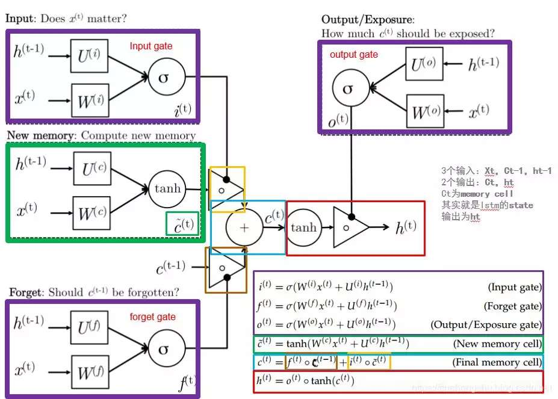

# LSTM
一种特殊的RNN类型、可以学习长期依赖信息
## RNN  
x0-xt输入序列  
h0-ht输出序列

## Core Idea
cell state，即拥有一些小的线性交互的传送带，串通整个链条  
LSTM通过“门”来给cell state清除或添加信息，“门”让信息选择性的通过，由sigmoid层和一个点乘操作构成。sigmoid层决定每个部件有多少信息可以保留，0代表没有任何信息，1代表全部信息都通过。每个LSTM单元拥有三个“门”。  
## Step-by-Step LSTM Walk Through
  
1. 通过“遗忘门”决定丢弃什么信息  
   遗忘门的输入是当前输入和上一时刻的输出，例如在语言类任务的学习中，当新的主语出现时，之前的主语需要被遗忘。  
   $f_{t}=\sigma (W_{f}\cdot [h_{t-1},x_t]+b_f)$  
2. “输入门”和经过tanh函数的候选值$\widetilde{C_t}$得到cell state中需要存储的信息，即new_memory  
   $i_t=\sigma(W_i\cdot [h_{t-1},x_t]+b_i)$  
   $\widetilde{C_t}=\tanh(W_C\cdot [h_{t-1},x_t]+b_C)$
3. 更新t时刻的状态值$C_t$  
   对上一时刻的状态经过遗忘门选择要保留的信息，对当前候选经过输入门选择要增加的信息，对状态进行更新  
   $C_t=f_t\ast C_{t-1}+i_t\ast \widetilde{C_t}$  
4. “输出门”决定输出  
   对当前状态进行tanh，然后通过输出门选择输出  
   $o_t=\sigma (W_o\cdot[h_{t-1},x_t]+b_o)$  
   $h_t=o_t\ast \tanh(C_t)$  
  
单元的输入是当前输入值$x_t$和上一单元的输出$h_{t-1}$，以及上一时刻的状态$C_{t-1}$；三个门的输入是当前输入值$x_t$和上一单元的输出$h_{t-1}$  
最终的输出是此刻的状态$C_t$和本单元的输出$h_t$  

  
图示与上述表示略有区别  

一些变体LSTM
  
peepholes 在三个门中都加入了上一时刻的状态输入  
$f_{t}=\sigma (W_{f}\cdot [C_{t-1},h_{t-1},x_t]+b_f)$  
  
计算当前状态时，使用遗忘门和非遗忘门
$C_t=f_t\ast C_{t-1}+(1-f_t)\ast \widetilde{C_t}$  
  
GRU  
将输入门和遗忘门整合，cell state和hidden state整合

