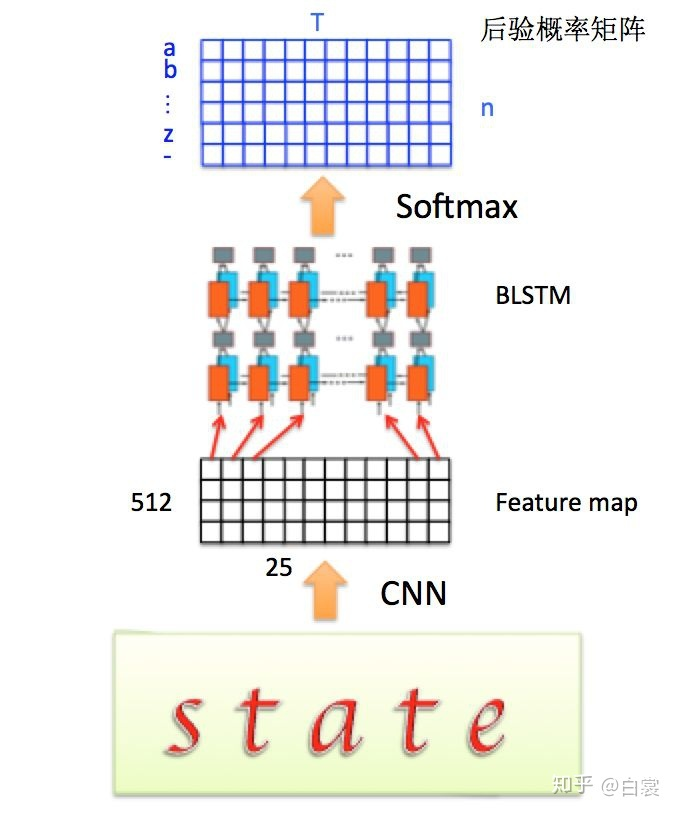

# CRNN
## 特点
1. 端到端
2. 不定长
3. 不受字典限制
4. 高效且轻巧
## 网络结构
  
从底向上分别是卷积层、循环层、转录层。卷积层从输入图像中提取序列特征，循环层预测每一帧的标签分布，转录层将每一帧的预测变为最终的预测序列。  
RNN使用深层双向结构。  
- 输入图像固定长宽比的情况下缩放到$32\times W\times 3$大小（W代表任意宽度）  
- 经过CNN卷积层提取特征后输出为$1\times (W/4)\times 512$  
- 针对LSTM设置$T=(W/4)$，将特征输入LSTM
  

### CNN feature map
  特征图大小为$m\cdot T$(m=512, T=25)  
  定义$x=(x^1,x^2,...,x^T)$  
  其中每列$x^t$为：  
  $$x^t=(x_1^t,x_2^t,...,x_m^t)$$

### BLSTM
     
  LSTM的每个时间片后接softmax，输出y是后验概率矩阵，定义为：  
  $$y=(y^1,y^2,...,y^t,...y^T)$$
  其中每列$y^t$为：
  $$y^t=(y_1^t,y_2^t,...,y_n^t)$$  
  满足：  
  $$\sum_ky_k^t=1$$
  其中n代表需要识别的字符集合长度（个人理解，例如我们要识别的字符是小写英文字符，则一共有26个字母，n=26，每一$y_n^t$代表第t列属于第n类字符的概率），对每列y进行argmax()操作，即可获得每一列输出字符的类别。  
  那么LSTM可以表示为：
  $$y=N_\omega(x)$$
  其中$\omega$表示LSTM的参数。  
- 空白blank符号
  考虑到有的位置没有字符，定义插入blank的字符集合，例如26个英文字母加上blank字符“-”，一共27个类别
### 转录层
- β变换：
  将LSTM的输出变换为字符输出结果，主要是去除空格及合并重复检测到的字符  
  例如：
  $$\Beta(\pi_1)=\Beta(--stta-t---e)=state$$
  $$\Beta(\pi_2)=\Beta(sst-aaa-tee)=state$$
## 训练
对LSTM，给定输入x的情况下，输出为l的概率是：
$$p(l|x)=\sum{_{\pi\in \Beta^{-1}(l)}}p(\pi|x)$$
其中$\pi \in{\Beta^{-1}(l)}$代表经过变换后是$l$的路径π，对于任意一条路径π有：
$$p(\pi|x)=\prod_{t=1}^T y^t_{\pi_t}$$
这里$y^t_{\pi_t}$中的$\pi_t$下标t表示π路径的每一时刻。上面$\Beta$变换中的$\pi_1 \pi_2$是代表不同的路径。  
例如对于T=12的$\pi_1$路径：
$$\pi_1=(--stta-t--e)$$  
$$p(\pi_1|x)=y^1_-\cdot y^2_-\cdot y^3_s\cdot y^4_t\cdot y^5_t\cdot y^6_a\cdot y^7_-\cdot y^8_t\cdot y^9_-\cdot y^{10}_-\cdot y^{11}_e$$
### 目标
通过调整参数ω使得输入为x时，输出是l的概率最大。 

## CTC(connectionist temporal classification)
loss好复杂，没看懂
##### 前向递推
##### 反向递推