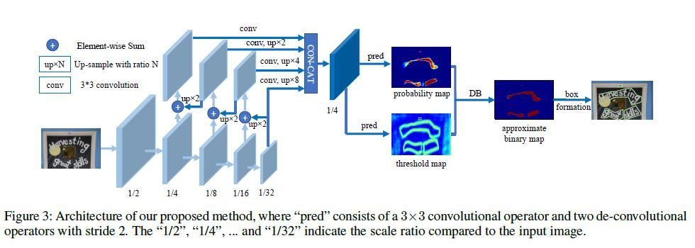

# DB Differentiable Binarization
原文：Real-time Scene Text Detection with Differentiable Binarization
## 核心思想
之前以分割做文本检测时，对像素分类为文本和非文本，根据是文本的possibility，设置一个阈值t，大于t的视为文本像素，小于t的视为非文本像素，然后再进行后处理的区域处理，得到文本行。文章将阈值t作为一个可训练的map，在训练时使用特征对图像中的t值进行预测，测试时就不需要人工找到最优阈值

## 网络结构
  
输入图像经过backbone网络提取特征金字塔，所有的特征金字塔经过上采样到相同尺度，串联得到特征F，F再进行训练预测概率图$P$和阈值图$T$，通过$P$和$T$计算得到近似二值图$\widehat{B}$，最后通过$\widehat{B}$经过后处理得到文本边界框  
$$\widehat{B}_{i,j}=\frac{1}{1+e^{-k(P_{i,j}-T_{i,j})}}$$
$k$根据经验设为50，近似二值图与一般的二值化公式效果类似：
$$B_{i,j}=
\begin{cases}
1　if\ P_{i,j}>=t,\\
0　otherwise.
\end{cases}$$
但是由于$\widehat{B}$可微，因此可以在网络的训练过程中进行优化。

## 标签
对于正常的文本框标签$G$，向内收缩得到文本框$G_s$，作为概率图的标签；  
向外膨胀得到文本框$G_d$，计算$G_s$和$G_d$之间像素到原始文本框$G$之间的最短距离，作为阈值图标签。
收缩和膨胀的偏置为：
$$D=\frac{A(1-r^2)}{L}$$
$r$设为0.4。$L$是文本框周长，$A$是文本框面积

## 损失函数
$$L=L_s + \alpha \times L_b+\beta \times L_t$$
其中$L_s$是概率图$P$的损失，$L_b$是二值图$\widehat{B}$的损失，$\alpha$和$\beta$分别设为1和10。$L_s$和$L_b$使用二值交叉熵损失：
$$L_s=L_b=\sum_{i\in S_l}y_i\log x_i+(1-y_i)\log (1-x_i)$$
为了平衡正负样本，对负样本进行采样，$S_l$是正负样本比例为1:3的样本集。
其中阈值损失$L_t$是膨胀文本框$G_d$内预测值和标签值的$L1$距离和：
$$L_t=\sum_{i \in R_d}|y_i^*-x_i^*|$$
其中$R_d$是在膨胀文本框内的像素indexs，$y^\*$是对应的阈值图标签。
实际在代码中：  
$$loss = diceLoss + self.l1Scale * l1Loss + bceLoss * self.bceScale$$
dice_loss是计算的二值化图的loss，l1_loss是计算的阈值图的loss，系数10, bce_loss是计算的概率图的loss，系数5

## 推理
文中说在推理时，使用预测的概率图和近似二值图生成文本框结果几乎一样，因此可以直接使用概率图，而在推理时去除预测阈值图。  
生成文本框的过程：
- 概率图首先以0.2为阈值进行二值化，得到二值图
- 通过二值图得到连接区域（收缩文本区域）
- 收缩文本区域进行膨胀，偏置为$D'$:
  $$D'=\frac{A' \times r'}{L'}$$
  $r'$设为1.5，$A'$为收缩多边形面积，$L'$为收缩多边形周长。
