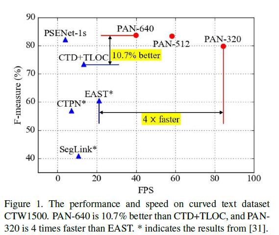
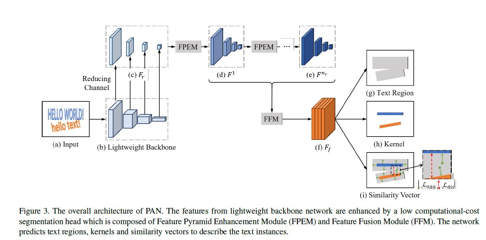
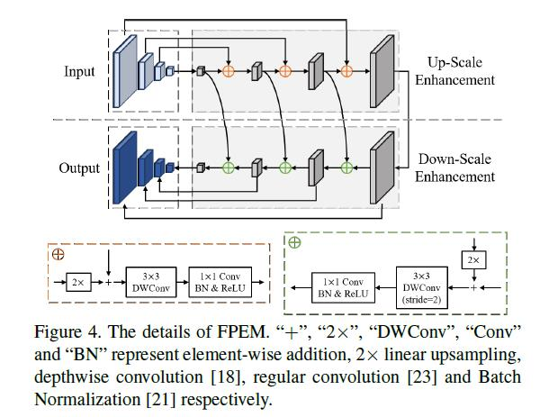
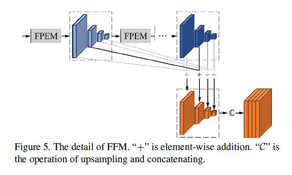

# PAN-Pixel Aggregation Network
## 解决问题
- 速度和精度的平衡
- 任意形状的文本行

## 效果对比

## 网络结构
和PSENet相比:
- 将前期利用FPN从backbone提取特征复杂化了，在FPN后接了FPEM和FFM，之后再加upsample和concatenate  
- 输出不是几个大小不同的kernel，输出是TextRegion, Kernel（一个）, Similarity Vector，利用Similarity Vector来膨胀kernel得到完整的text region

## 训练
### Loss
#### 总误差
$$L=L_{tex}+\alpha L_{ker}+\beta (L_{agg}+L_{dis})$$
$\alpha$和$\beta$分别被设置为0.5和0.25
#### 文本区域误差
$$L_{tex}=1-\frac{2\sum_i{P_{tex}(i)G_{tex}(i)}}{\sum_i{P_{tex}(i)^2}+\sum_i{G_{tex}(i)^2}}$$
$L_{tex}(i)$和$G_{tex}(i)$分别指分割结果和真实文本行中的第i个像素，真实值是01二值图像，文本像素值为1，其他像素值为0
#### 核误差
$$L_{ker}=1-\frac{2\sum_i{P_{ker}(i)G_{ker}(i)}}{\sum_i{P_{ker}(i)^2}+\sum_i{G_{ker}(i)^2}}$$
$L_{ker}(i)$和$G_{ker}(i)$分别指预测核和真实核中的第i个像素，真实核是通过真实文本行四边形收缩得到的，收缩比例在icdar2015数据集上设为0.5，其他数据集上设为0.5
#### 像素聚合误差
$$L_{agg}=\frac{1}{N}\sum_{i=1}^{N}{\frac{1}{|T_i|}}\sum_{p\in{T_i}}{ln(D(p, K_i)+1)}$$
$$D(p,K_i)=max(\|F(p)-G(K_i)\|-\delta_{agg},0)^2$$
公式中，$N$是文本行数量，$T_i$是第i个文本行，D(p, K_i)定义文本像素$p$和文本行$T_i$的核$K_i$之间的距离，$\delta_{agg}$是常数，设为0.5.$F(p)$是像素$p$的相似向量，$G(K_i)$是核&K_i&的相似向量，计算方式为：$\sum_{q\in{K_i}}{F(q)}/{|K_i|}$
#### 文本区分误差（不同的文本行之间的距离）
$$L_{dis}=\frac{1}{N(N-1)}\sum_{i=1}^N\sum_{j=1,j\ne i}ln(D(K_i,K_j)+1)$$
$$D(K_i,K_j)=max(\delta_{dis}-\|G(K_i)-G(K_j)\|,0)^2$$
$L_{dis}$控制核之间的距离不小于$\delta_{dis}$，设为3，测试时设为6
