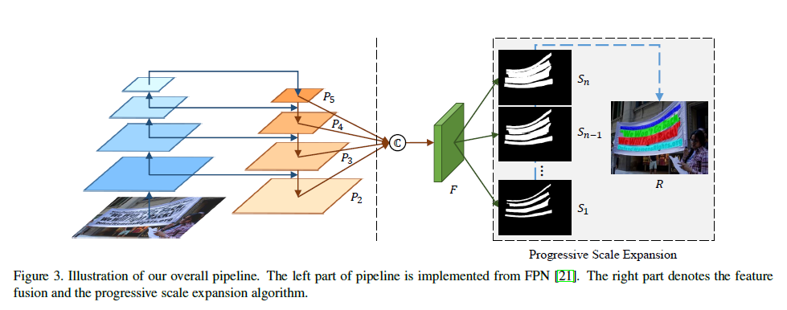
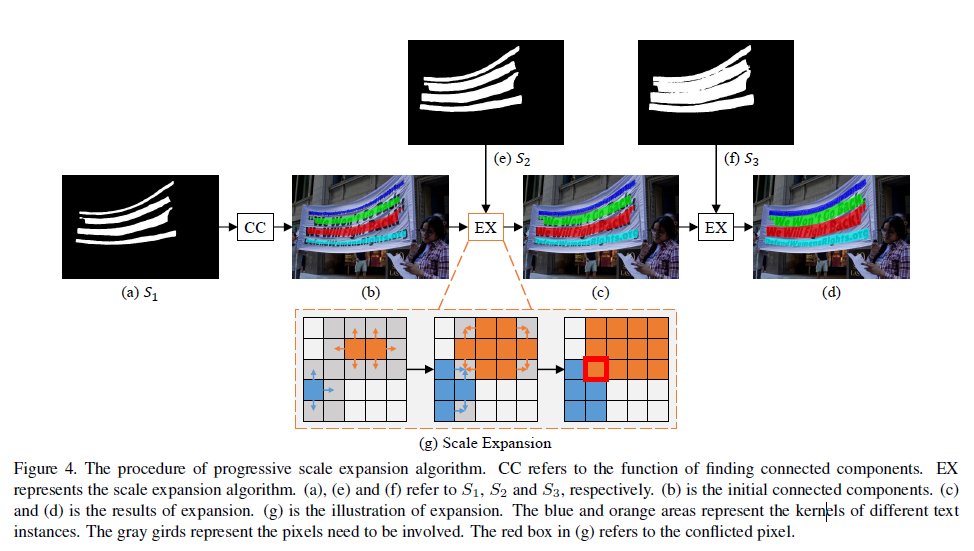
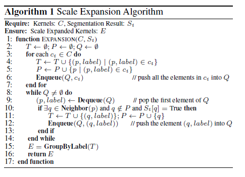
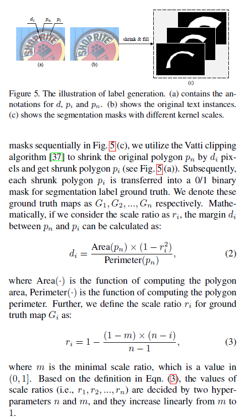
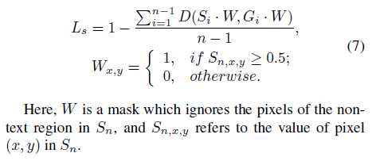

# PSENet
Progressive Scale Expansion Network 逐步尺度扩张
## 问题：
Online Hard Example Mining (OHEM)是个啥？文章在Complete Text Loss计算时使用到这个。  
## 关键点：
1. 利用语义分割解决弧形文字的检测
2. 利用kernel分离相邻文本行（文本行的中心）
3. 利用广度优先搜索不断合并周围像素，扩展kernel得到完整文本行  

## 网络结构
  
以FPN为框架基础，提取backbone网络(ResNet)四层不同尺度的特征，自顶向下上采样和拼接合并，得到F。  
右侧预测不同kernel scale的分割图，S1是最小kernel scale，Sn是最大(完整文本行)，通过渐进扩展算法不断扩展S1得到Sn.
### 渐进扩展算法（Progressive scale expansion）
  
原始预测kernel（图a，S1）首先通过CC（寻找连通域）得到初始文本行（图b），之后经过扩展操作（EX，如图g）得到图c(s2)，再次扩展得到图d（S3）  
扩展操作基于广度优先搜索（BFS，Breadth-First-Search）。  
starts from the pixels of multiple kernels and iteratively merges the adjacent text pixels.  
对于多个核的合并，有些像素可能会被多个核进行合并，此时采取先到先得策略处理冲突像素。  
  

## 训练
### ground truth
原始标注对应于Sn的label，通过缩小（Vatti clipping algorithm）对应倍数得到Si的label
  
### Loss
$$L = λL_c + (1-λ)L_s$$
$L_c$: Complete text loss
$L_s$: Shrunk text loss
#### Complete text loss
$$L_c = 1 - D(S_n\cdot M, G_n\cdot M)$$
$D$是dice coefficient, $M$是Online Hard Example Mining得到的Mask
#### Shrunk text loss

