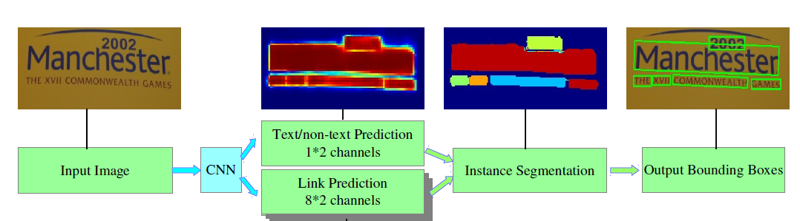
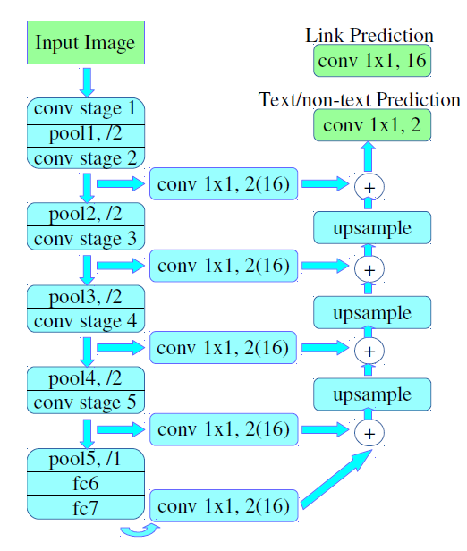

# PixelLink
## 问题
link标签一个像素只有一个？输出link却是8邻域的？  
解决:并不是一个像素一个标签，原文中写的是：  
For a given pixel and one of its eight neighbors, if they belong to the same instance, the link between them is positive. Otherwise negative.  
所以每个像素的八个邻域像素都有对应的link标签
## 网络结构
整体流程：  
先通过深度学习网络预测pixel positive和link positive，并根据link positive连接pixel positive得到文本实例分割图，然后从分割图中直接提取文本行的bbox  

具体步骤：  
1. 主干网络是SSD结构，首先用VGG16作为base net, 将最后两个全连接改成卷积
2. 提取不同层的feature map。  
   PixelLink+VGG16 2s网络：提取了conv2_2, conv3_3, conv4_3, conv5_3, fc_7。得到特征图为原图1/2  
   PixelLink+VGG16 4s网络：提取了conv3_3,conv4_3, conv5_3, fc_7。得到特征图为原图1/4
3. 对已提取的特征层，进行自顶向下的融合，先上采样，再add。（这里包含了两种操作：pixel cls和pixel link，对应的卷积核个数分别为2和16）
4. 网络输出包含文本/非文本预测和link预测  

## 训练
### ground truth
像素的生成规则：在文本行bbox内的pixel被标注成positive，如果存在重叠文本时，则非重叠的文本框区域内的像素被标注成positive，否则被标注成negative   
像素间的link生成规则：给定一个像素，若其与邻域的8像素都属于同一个文本实例，则将其link标注为positive，否则标注为negative   
这里值得注意的是：ground truth的计算是在缩放后(具体缩放的比例与其预测的feature map大小一致)的原图上进行的  
### Loss
网络的损失函数包含两个部分：pixels loss和links loss  
Pixel Loss:  
对positive pixel: Instance-Balanced Cross-Entropy Loss  
对negative pixel: 根据比例r，文本行实例的总面积S，选择loss倒序后前r*S个negative pixel  
Link Loss:  
只对positive pixel计算link loss

## 相关概念
### 语义分割和实例分割  
语义分割：将图像中的每个像素赋予一个类别标签，只能判断类别，无法区分个体。（同类的像素点是否来自同一个个体，无法判断）。  
实例分割：类似物体检测，但输出的是mask而不是bounding box，无需对每个像素标记，只需找出物体边缘轮廓。可以区分单个个体。  
全景分割：语义分割和实例分割的结合，每个像素都进行分类，每个类别可以区分多个实例。 
### 连接像素
通过设定两个不同的阈值，可以得到pixel positive集合和link positive集合，然后根据link positive将pixel positive进行连接，得到CCs(conected components)集合，集合中的每个元素代表的就是文本实例。  
这里需要特别注意：给定两个相邻的pixel positive，它们之间的link预测是由当前两个pixel共同决定的．而当前两个pixel需要连接(即两个像素属于同一个文本实例)的前提条件：two link中至少有一个link positive．连接的规则采用的是Disjoint set data structure(并查集)的方法．  
### 并查集
举个栗子  
初始化时，(2,4)，(5,7)，(1,3)，(8,9) ， (1,2)，(5,6)， (2,3)为原始相关节点。在合并过程中，将两两有关系的进行合并操作。最终，(2,4) (1,2) (2,3)合并为{1,2,3,4}，(5,7) (5,6)合并为{5,6,7}，(8,9)没有进行合并，继续保存为{8,9}。  

(2,4) {2,4}  
(5,7) {2,4}{5,7}  
(1,3) {1,3}{2,4} {5,7}  
(8,9) {1,3}{2,4} {5,7} {8,9}  
(1,2) {1,2,3,4}{5,7} {8,9}  
(5,6) {1,2,3,4}{5,6,7} {8,9}  
(2,3) {1,2,3,4}{5,6,7} {8,9}  
### 提取文本行bounding box
直接从分割结果中提取BBOX，opencv的minAreaRext

## 总结
1. 与CTPN，EAST，SegLink相比，PixelLink放弃了边框回归方法来检测文本行的bbox，而是采用实例分割方法，直接从分割的文本行区域得到文本行的bbox．PixelLink可以以更少额数据和更快地速度进行训练。  
2. 假设提取特征的主干网络结构采用VGG16(当然你也可以采用其它主干网络结构)，PixelLink不需要在imagenet预训练的模型上进行fine-tuned（即直接从头开始训练），而CTPN，EAST，SegLink都需要在imagenet预训练的模型上进行fine-tuned
3. 与CTPN，EAST，SegLink相比，PixelLink对感受野的要求更少，因为每个神经元值只负责预测自己及其邻域内的状态。  
4. 与SegLink一样，不能检测很大的文本，这是因为link主要是用于连接相邻的segments，而不能用于检测相距较远的文本行
